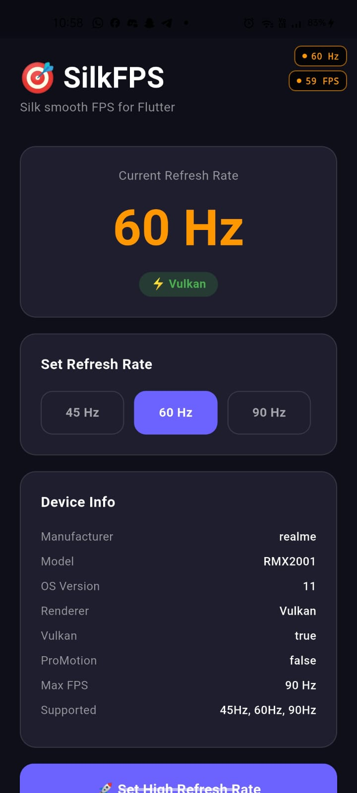
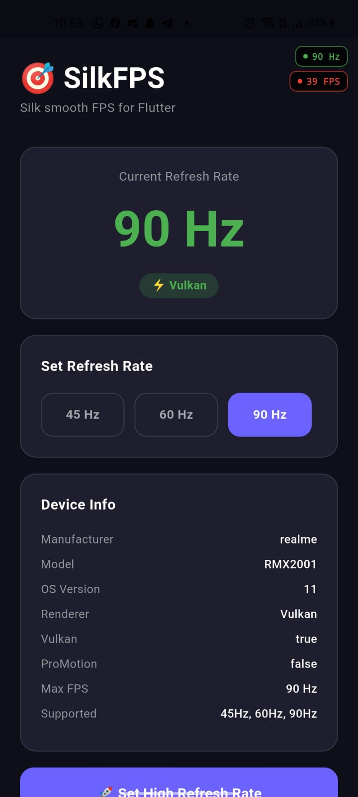
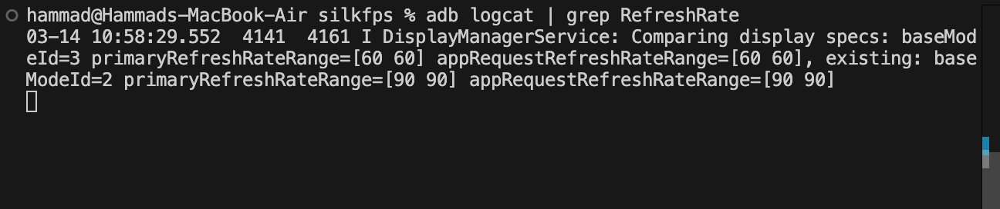

# SilkFPS 🎯

[](https://pub.dev/packages/silkfps)
[](https://opensource.org/licenses/MIT)
[](https://pub.dev/packages/silkfps)

**Silk smooth FPS boost for Flutter apps.**  
Auto-detects Vulkan/Skia on Android and Metal/ProMotion on iOS. Includes real-time FPS monitoring, battery saver mode, adaptive scroll mode, per-route FPS control, and a live FPS overlay badge.

---

## 📸 Screenshots

<p align="center">
  
  &nbsp;&nbsp;
  
</p>
<p align="center">
  <em>Left: Default 60Hz &nbsp;|&nbsp; Right: SilkFPS boosted to 90Hz ⚡</em>
</p>

<p align="center">
  
</p>
<p align="center">
  <em>adb logcat confirming <code>appRequestRefreshRateRange=[90 90]</code> — plugin working ✅</em>
</p>

---

## ✨ Features

| Feature | flutter_displaymode | **SilkFPS** |
|---|---|---|
| High refresh rate | ✅ Android only | ✅ Android + iOS |
| Vulkan auto-detect | ❌ | ✅ |
| iOS Metal/ProMotion | ❌ | ✅ |
| Real-time FPS stream | ❌ | ✅ |
| Live FPS overlay badge | ❌ | ✅ |
| Battery saver mode | ❌ | ✅ |
| Adaptive scroll mode | ❌ | ✅ |
| Lifecycle aware | ❌ | ✅ |
| Per-route FPS | ❌ | ✅ |
| FPS analytics | ❌ | ✅ |
| Device info | ❌ | ✅ |
| One-line initialize | ❌ | ✅ |

---

## 📱 Platform Support

| Platform | Support |
|---|---|
| Android (Snapdragon) | ✅ Full — Vulkan + 90/120/144Hz |
| Android (MediaTek) | ✅ Partial — Skia fallback |
| iOS (ProMotion) | ✅ Full — Metal + 120Hz |
| iOS (Standard) | ✅ 60Hz |

---

## 🚀 Quick Start

### 1. Add dependency

```yaml
dependencies:
  silkfps: ^0.0.1
```

### 2. Android — Update `MainActivity.kt`

> ⚠️ **Important:** This step is required. After adding the plugin, you must update your app's `MainActivity.kt`.

```kotlin
// android/app/src/main/kotlin/your/package/MainActivity.kt
package your.package.name

import io.flutter.embedding.android.FlutterActivity
import android.os.Bundle
import android.content.pm.PackageManager

class MainActivity : FlutterActivity() {
    override fun onCreate(savedInstanceState: Bundle?) {
        super.onCreate(savedInstanceState)
        setOptimalRefreshRate()
    }

    private fun setOptimalRefreshRate() {
        try {
            if (android.os.Build.VERSION.SDK_INT >= android.os.Build.VERSION_CODES.M) {
                val display = windowManager.defaultDisplay
                val currentMode = display.mode
                display.supportedModes
                    .filter {
                        it.physicalWidth == currentMode.physicalWidth &&
                        it.physicalHeight == currentMode.physicalHeight
                    }
                    .maxByOrNull { it.refreshRate }
                    ?.let {
                        val params = window.attributes
                        params.preferredDisplayModeId = it.modeId
                        window.attributes = params
                    }
            }
            if (android.os.Build.VERSION.SDK_INT >= 34) {
                window.frameRateBoostOnTouchEnabled = true
            }
        } catch (e: Exception) {
            android.util.Log.e("SilkFPS", "Error: ${e.message}")
        }
    }
}
```

### 3. Android — Update `AndroidManifest.xml`

```xml
<application ...>
    <!-- SilkFPS — Vulkan on supported devices, Skia fallback on others -->
    <meta-data
        android:name="io.flutter.embedding.android.EnableVulkan"
        android:value="true" />
    ...
</application>
```

### 4. iOS — Update `Info.plist`

```xml
<!-- Enable ProMotion 120fps on iPhone 13 Pro and above -->
<key>CADisableMinimumFrameDurationOnPhone</key>
<true/>
```

### 5. `main.dart` — Initialize

```dart
import 'package:silkfps/silkfps.dart';

void main() async {
  WidgetsFlutterBinding.ensureInitialized();

  // ✅ One line — everything is automatic!
  await SilkFps.initialize(
    showFpsOverlay: true,       // Live FPS badge in the corner
    enableBatterySaver: true,   // Auto switch to 60fps on low battery
    batterySaverThreshold: 20,  // Switch at 20% battery
  );

  runApp(const MyApp());
}
```

### 6. Wrap your app — FPS Overlay

```dart
class MyApp extends StatelessWidget {
  @override
  Widget build(BuildContext context) {
    return MaterialApp(
      home: SilkFpsOverlay(
        show: SilkFps.showFpsOverlay,
        position: SilkOverlayPosition.topRight,
        setHz: 90, // The refresh rate you have set
        child: const MyHomePage(),
      ),
    );
  }
}
```

---

## 📖 API Reference

### `SilkFps` — Main Class

```dart
// Initialize — call once in main()
await SilkFps.initialize(
  showFpsOverlay: false,
  enableBatterySaver: false,
  batterySaverThreshold: 20,
);

// Set the highest available refresh rate
await SilkFps.setHighRefreshRate();

// Set a specific refresh rate
await SilkFps.setRefreshRate(90.0);

// Get the current refresh rate
double hz = await SilkFps.getCurrentRefreshRate();

// Get all supported refresh rates
List<double> rates = await SilkFps.getSupportedRefreshRates();
// Returns: [45.0, 60.0, 90.0]

// Check Vulkan support (Android only)
bool vulkan = await SilkFps.isVulkanSupported();

// Get battery level
int battery = await SilkFps.getBatteryLevel();

// Get device info
SilkDeviceInfo info = await SilkFps.getDeviceInfo();
print(info.manufacturer);           // realme
print(info.model);                  // RMX2001
print(info.renderer);               // Vulkan / Skia / Metal
print(info.maxRefreshRate);         // 90.0
print(info.isProMotion);            // false
print(info.supportedRefreshRates);  // [45.0, 60.0, 90.0]
```

---

### `SilkFpsMonitor` — Real-time FPS Stream

```dart
class MyWidget extends StatefulWidget { ... }

class _MyWidgetState extends State<MyWidget>
    with TickerProviderStateMixin {

  @override
  void initState() {
    super.initState();
    SilkFpsMonitor.start(this);
    SilkFpsMonitor.fpsStream.listen((fps) {
      print('Live FPS: $fps');
    });
  }

  @override
  void dispose() {
    SilkFpsMonitor.stop();
    super.dispose();
  }
}
```

---

### `SilkFpsOverlay` — Live FPS Badge Widget

```dart
SilkFpsOverlay(
  show: true,                             // Show or hide the badge
  position: SilkOverlayPosition.topRight, // Badge position on screen
  setHz: 90,                              // Target rate shown in badge
  child: MyWidget(),
)
```

**Available Positions:**
- `SilkOverlayPosition.topLeft`
- `SilkOverlayPosition.topRight`
- `SilkOverlayPosition.bottomLeft`
- `SilkOverlayPosition.bottomRight`

---

### `SilkAdaptive` — Smart FPS Management

```dart
// Battery Saver — auto switch to 60fps on low battery
await SilkAdaptive.enableBatterySaver(threshold: 20);
SilkAdaptive.disableBatterySaver();

// Adaptive Scroll — high FPS while scrolling, low FPS when idle
await SilkAdaptive.enableAdaptiveMode();
await SilkAdaptive.onScrollStart(); // Boost FPS
await SilkAdaptive.onScrollEnd();   // Drop FPS
SilkAdaptive.disableAdaptiveMode();

// Lifecycle Aware — 60fps in background, 90fps in foreground
SilkAdaptive.enableLifecycleAware(context);
SilkAdaptive.disableLifecycleAware();

// Per-Route FPS — different FPS for different screens
SilkAdaptive.setFpsForRoute('/home', 90);
SilkAdaptive.setFpsForRoute('/video', 120);
SilkAdaptive.setFpsForRoute('/settings', 60);

// Analytics
SilkAdaptive.recordFps(fps);
double avg = SilkAdaptive.getAverageFps();
double min = SilkAdaptive.getMinFps();
double max = SilkAdaptive.getMaxFps();
List<double> history = SilkAdaptive.getFpsHistory();
SilkAdaptive.clearHistory();
```

---

### `SilkDeviceInfo` — Device Information Model

```dart
SilkDeviceInfo info = await SilkFps.getDeviceInfo();

info.manufacturer           // "realme", "Samsung", "Apple"
info.model                  // "RMX2001", "S24", "iPhone 15 Pro"
info.osVersion              // "11", "14", "17.0"
info.apiLevel               // 30 (Android only)
info.isVulkanSupported      // true/false (Android)
info.isMetalSupported       // true/false (iOS)
info.isProMotion            // true if 120Hz+ (iPhone 13 Pro+)
info.maxRefreshRate         // 90.0, 120.0, 144.0
info.currentRefreshRate     // Current Hz
info.supportedRefreshRates  // [60.0, 90.0]
info.renderer               // "Vulkan", "Skia", "Metal"
```

---

## 🎯 Complete Example

```dart
import 'package:flutter/material.dart';
import 'package:silkfps/silkfps.dart';

void main() async {
  WidgetsFlutterBinding.ensureInitialized();

  // Per-route FPS configuration
  SilkAdaptive.setFpsForRoute('/home', 90);
  SilkAdaptive.setFpsForRoute('/settings', 60);

  await SilkFps.initialize(
    showFpsOverlay: true,
    enableBatterySaver: true,
    batterySaverThreshold: 20,
  );

  runApp(const MyApp());
}

class MyApp extends StatelessWidget {
  const MyApp({super.key});

  @override
  Widget build(BuildContext context) {
    return MaterialApp(
      home: SilkFpsOverlay(
        show: SilkFps.showFpsOverlay,
        position: SilkOverlayPosition.topRight,
        setHz: 90,
        child: const HomePage(),
      ),
    );
  }
}
```

---

## ⚠️ Known Limitations

- **MediaTek devices** — Some MediaTek chipsets (e.g. Helio G90T) may experience OS-level refresh rate drops when idle. This is an Android OS adaptive behavior, not a plugin limitation.
- **iOS** — Custom refresh rate selection is not supported. iOS automatically manages ProMotion.
- **Comparison with `flutter_displaymode`** — Unlike `flutter_displaymode` which is Android-only, SilkFPS supports both platforms with additional features.

---

## 📄 License

```
MIT License

Copyright (c) 2026 Muhammad Hammad

Permission is hereby granted, free of charge, to any person obtaining a copy
of this software and associated documentation files (the "Software"), to deal
in the Software without restriction, including without limitation the rights
to use, copy, modify, merge, publish, distribute, sublicense, and/or sell
copies of the Software, and to permit persons to whom the Software is
furnished to do so, subject to the following conditions:

The above copyright notice and this permission notice shall be included in all
copies or substantial portions of the Software.

THE SOFTWARE IS PROVIDED "AS IS", WITHOUT WARRANTY OF ANY KIND, EXPRESS OR
IMPLIED, INCLUDING BUT NOT LIMITED TO THE WARRANTIES OF MERCHANTABILITY,
FITNESS FOR A PARTICULAR PURPOSE AND NONINFRINGEMENT. IN NO EVENT SHALL THE
AUTHORS OR COPYRIGHT HOLDERS BE LIABLE FOR ANY CLAIM, DAMAGES OR OTHER
LIABILITY, WHETHER IN AN ACTION OF CONTRACT, TORT OR OTHERWISE, ARISING FROM,
OUT OF OR IN CONNECTION WITH THE SOFTWARE OR THE USE OR OTHER DEALINGS IN THE
SOFTWARE.
```

---

## 🤝 Contributing

Contributions are welcome! Please feel free to submit a Pull Request.

1. Fork the repo
2. Create your feature branch (`git checkout -b feature/AmazingFeature`)
3. Commit your changes (`git commit -m 'Add AmazingFeature'`)
4. Push to the branch (`git push origin feature/AmazingFeature`)
5. Open a Pull Request

---

## 📬 Issues

Found a bug? Please open an issue on [GitHub](https://github.com/yourusername/silkfps/issues).

---

*Made with ❤️ for the Flutter community*